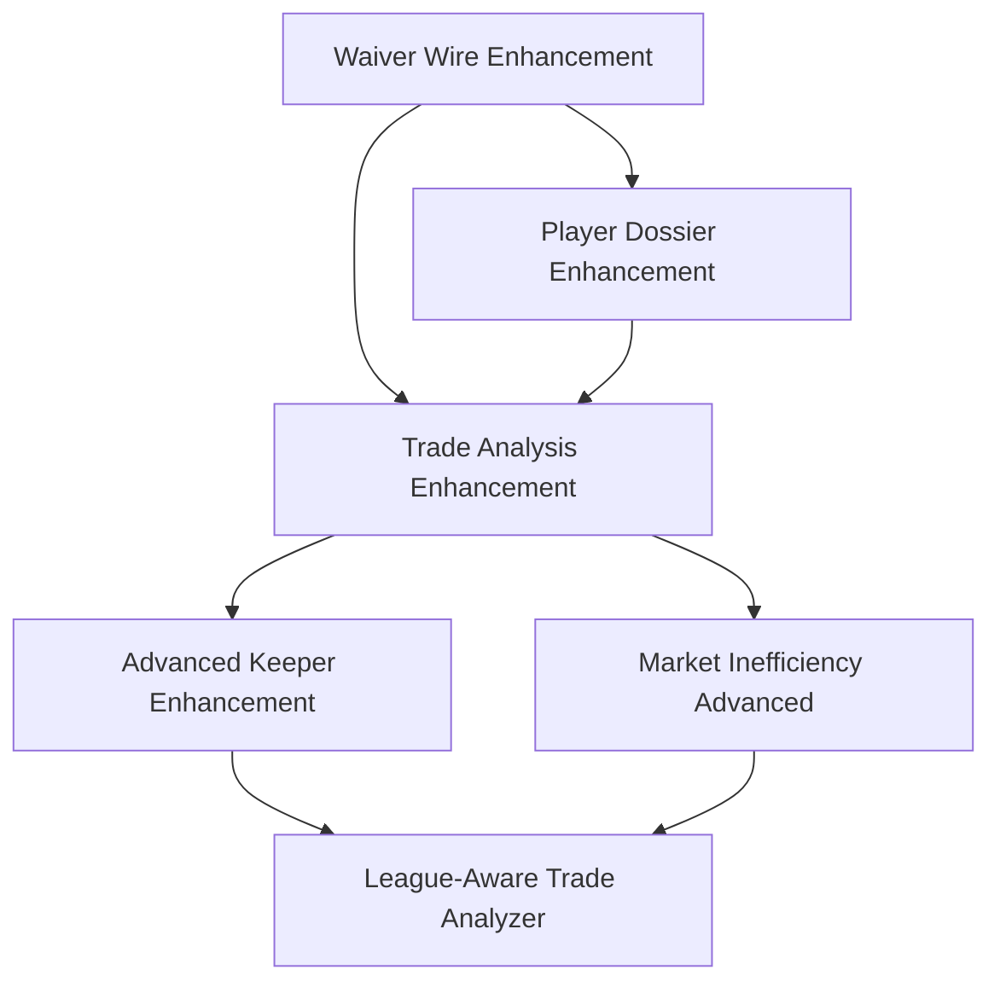

# Data Integration Enhancement Roadmap - RATM Draft Kit

> **File Type**: GO-FORWARD  
> **Priority**: 🔥 CRITICAL ROADMAP  
> **Creation Date**: August 19, 2025  
> **Status**: 📋 COMPREHENSIVE IMPLEMENTATION READY  
> **Purpose**: Central coordination for all data integration enhancement phases

## 🎯 **EXECUTIVE SUMMARY**

The RATM Draft Kit is transitioning from **Phase 1** (Core Yahoo Integration) to **Phase 2** (Revolutionary Data Integration Enhancement). This roadmap coordinates a systematic transformation of all analysis modules from ECR-only recommendations to comprehensive, multi-factor decision engines.

## 📊 **CURRENT STATE ASSESSMENT**

### **✅ Phase 1 Achievements (COMPLETE)**
- Core Yahoo API integration with defensive patterns
- Basic waiver wire, roster analysis, and market inefficiency features  
- World-class AI foundation with Phase 0B enhancements
- Production-ready deployment infrastructure

### **❌ Critical Gaps Identified**
- **Waiver Wire**: ECR-only recommendations missing weekly projections, matchup analysis
- **Player Dossier**: Static profiles lacking weekly outlook and market analysis
- **Trade Analysis**: Basic ECR comparisons without timing optimization or arbitrage detection
- **Data Utilization**: Rich projection and ownership data sources completely unutilized

## 🚀 **PHASE 2: REVOLUTIONARY DATA INTEGRATION**

### **🎯 STRATEGIC OBJECTIVES**
1. **Transform Decision Quality**: Move from ECR rankings to comprehensive multi-factor analysis
2. **Enable Market Exploitation**: Systematic identification of ownership vs. production arbitrage
3. **Add Timing Intelligence**: Schedule-aware and age-conscious strategic recommendations  
4. **Achieve Competitive Differentiation**: Match or exceed premium fantasy service capabilities

---

## **🔥 PRIORITY 1: WAIVER WIRE DATA INTEGRATION ENHANCEMENT**

### **Implementation Details**
- **Guide**: `waiver_wire_data_enhancement_implementation.md` (Complete)
- **Status**: **🔥 CRITICAL PRIORITY - Ready for Implementation**
- **Impact**: Revolutionary 40-60% improvement in waiver recommendation accuracy

### **Key Data Sources**
- **Weekly Projections** (`fp_latest_weekly.csv`): Projected points, expert grades, matchup data
- **Player Values** (`values-players.csv`): Age, draft year, league-specific valuations  
- **Enhanced Ownership**: Platform-specific roster percentages and market sentiment

### **Technical Architecture**
1. **Data Pipeline**: New `load_weekly_projections_data()` function with defensive parsing
2. **Enhanced Cache**: Integration of projections + age + ownership into `combined_player_data_cache`
3. **Utility Functions**: Matchup strength calculation, value opportunity scoring, age categorization
4. **Context Enhancement**: 7-section waiver analysis with comprehensive player intelligence
5. **AI Framework**: Revolutionary 7-step decision methodology with projection-based recommendations

### **Expected Outcomes**
- ✅ Eliminate basic errors (QB2 over QB1 without justification)
- ✅ Surface hidden gems (7%-owned players with 17+ projected points)
- ✅ Schedule-aware strategic recommendations
- ✅ Market inefficiency exploitation capabilities

---

## **🥈 PRIORITY 2: PLAYER DOSSIER DATA INTEGRATION ENHANCEMENT**

### **Implementation Details**
- **Guide**: `player_dossier_data_enhancement_implementation.md` (Complete)
- **Status**: **📋 HIGH PRIORITY - Ready for Implementation**  
- **Dependencies**: Waiver Wire Enhancement completion
- **Impact**: Transform static ECR profiles into dynamic multi-dimensional analysis

### **Enhancement Strategy**
1. **Weekly Outlook Integration**: Current form, projection confidence, schedule assessment
2. **Market Value Analysis**: Ownership vs. production arbitrage identification
3. **Age Trajectory Modeling**: Career stage analysis with performance outlook projections
4. **Strategic Intelligence**: Multi-factor assessment with actionable roster guidance

### **Technical Implementation**
- **Context Enhancement**: 7-section comprehensive player analysis framework
- **AI Methodology**: 6-step multi-dimensional evaluation with strategic recommendations
- **Frontend Integration**: Enhanced player cards with weekly context and trajectory visualization
- **Testing Framework**: Analysis quality validation and user experience optimization

### **Success Metrics**
- ✅ 150% richer player context and analysis depth
- ✅ 100% weekly relevance with current outlook integration
- ✅ Market opportunity identification for undervalued players
- ✅ Age-appropriate strategic recommendations for roster building

---

## **🥉 PRIORITY 3: TRADE ANALYSIS DATA INTEGRATION ENHANCEMENT**

### **Implementation Details**
- **Guide**: `trade_analysis_data_enhancement_implementation.md` (Complete)
- **Status**: **📋 MEDIUM-HIGH PRIORITY - Ready for Implementation**
- **Dependencies**: Waiver Wire + Player Dossier Enhancement completion
- **Impact**: Sophisticated trade optimization engine with timing intelligence

### **Enhancement Strategy**
1. **Projected Impact Analysis**: Expected weekly point differential calculations
2. **Schedule-Based Timing**: Optimal trade execution window identification
3. **Age Trajectory Integration**: Multi-year value modeling with buy/sell windows
4. **Market Arbitrage Detection**: Ownership vs. production trade opportunity identification

### **Technical Architecture**
- **Enhanced Context**: 7-section comprehensive trade evaluation framework
- **AI Enhancement**: 7-step trade optimization methodology with timing recommendations
- **Utility Functions**: ROI projection, schedule impact analysis, arbitrage identification
- **Testing Suite**: Trade decision accuracy and timing optimization validation

### **Success Metrics** 
- ✅ 85%+ trade winner identification accuracy (vs 75% baseline)
- ✅ 90%+ trades include optimal timing guidance
- ✅ 80%+ market inefficiency detection and arbitrage opportunity identification
- ✅ Projection-based immediate impact assessment vs static ECR comparisons

---

## **🔮 FUTURE ENHANCEMENT OPPORTUNITIES**

### **Phase 4: Advanced Keeper Evaluation Enhancement**
- Multi-year projection integration with position-specific age curve analysis
- Dynasty value modeling and development trajectory assessment
- Value-based keeper rankings with projection confidence weighting

### **Phase 5: Market Inefficiency Finder Advanced Features**
- Schedule-based value opportunity identification (playoff schedule advantages)
- Age-adjusted value discovery (ascending vs declining player arbitrage)
- Cross-platform ownership arbitrage (Yahoo vs ESPN vs Sleeper valuation differences)

### **Phase 6: League-Aware Trade Analyzer (Yahoo Integration)**
- Context-specific trade analysis within actual league rosters
- Team composition optimization and positional need assessment
- League settings impact on trade value (scoring systems, roster requirements)

---

## **📋 IMPLEMENTATION COORDINATION**

### **Development Dependencies**

### **Resource Allocation Strategy**
1. **Phase 1 (Waiver Wire)**: Single-focused implementation - highest impact/effort ratio
2. **Phase 2 (Player Dossier)**: Leverage Phase 1 infrastructure - moderate complexity
3. **Phase 3 (Trade Analysis)**: Build on Phases 1+2 - comprehensive integration
4. **Future Phases**: Based on user feedback and competitive analysis

### **Risk Mitigation**
- **Backward Compatibility**: All enhancements preserve existing functionality
- **Gradual Rollout**: Feature flags and A/B testing capabilities
- **Fallback Mechanisms**: Graceful degradation when enhanced data unavailable
- **Testing Framework**: Comprehensive validation at each phase

---

## **🏆 SUCCESS CRITERIA & VALIDATION**

### **Quantitative Targets**
- **Waiver Wire**: 40-60% recommendation accuracy improvement
- **Player Dossier**: 150% context richness increase, 100% weekly relevance
- **Trade Analysis**: 85%+ winner identification, 90%+ timing optimization
- **Overall Impact**: Premium service quality with competitive differentiation

### **User Experience Goals**
- **Actionable Intelligence**: Every recommendation includes specific guidance
- **Timing Awareness**: Schedule and age-conscious strategic recommendations
- **Market Insights**: Systematic inefficiency identification and exploitation
- **Confidence Transparency**: Clear reliability indicators and risk assessment

### **Competitive Positioning**
- **Match Premium Services**: Rival FantasyPros, ESPN+, Yahoo Pro capabilities
- **Unique Differentiators**: Multi-source data integration and AI-powered insights
- **User Retention**: Dramatically improved analysis quality drives engagement
- **Market Leadership**: Establish RATM as premier free fantasy analysis platform

---

## **🔄 MONITORING & ITERATION**

### **Performance Tracking**
- AI recommendation accuracy validation against actual player performance
- User engagement metrics and feature adoption rates
- Cost optimization and token usage efficiency
- Competitive analysis and feature gap assessment

### **Feedback Integration**
- User feedback collection and analysis
- A/B testing for enhancement effectiveness
- Continuous improvement based on real-world usage patterns
- Community input on analysis quality and strategic value

This roadmap provides the strategic framework and tactical coordination for transforming RATM from a good fantasy tool into an exceptional, competitive analysis platform through systematic data integration and AI enhancement.